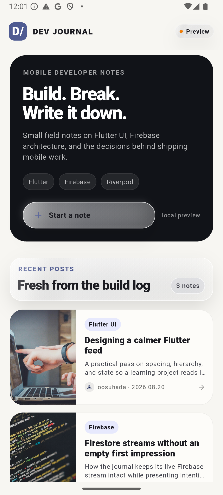
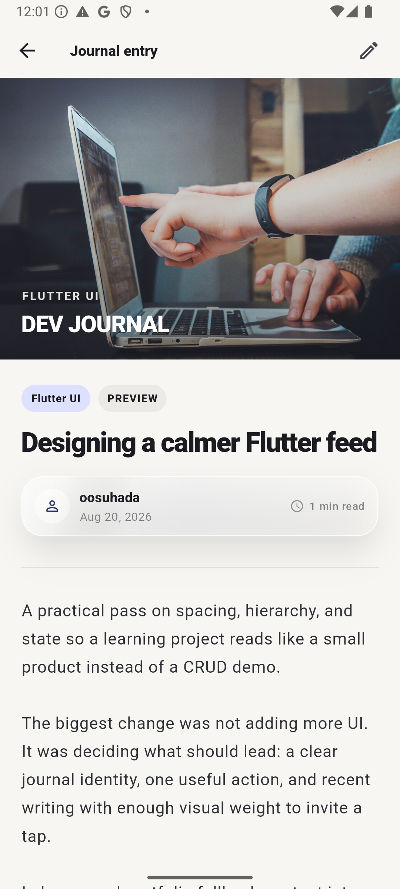
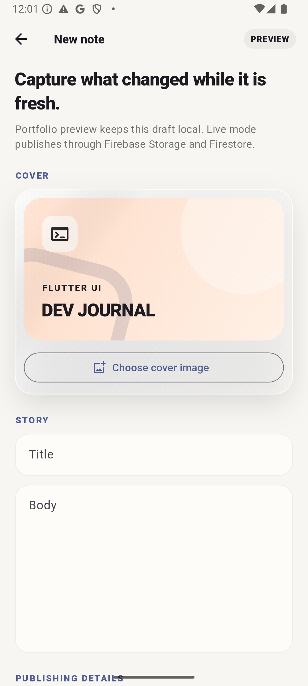
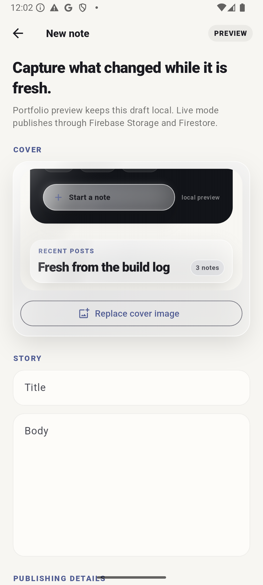

# Dev Journal — Flutter + Firebase

An Android-first mobile developer journal built with Flutter, Riverpod, Firestore, and Firebase Storage. It preserves the real Firebase CRUD flow while presenting the project as a compact, portfolio-ready blog product.

Flutter, Riverpod, Firestore, Firebase Storage로 만든 Android 중심의 모바일 개발 저널입니다. 실제 Firebase CRUD 흐름은 유지하면서도, 포트폴리오에서 바로 제품 형태를 확인할 수 있는 작은 개발 블로그 경험으로 정리했습니다.

## v1 → v2 / 성장 과정

| | v1 · learning phase | v2 · renewal |
| --- | --- | --- |
| Focus | Feature implementation and Firebase CRUD | Adaptive UI and clearer interaction hierarchy |
| Controls | Default Material controls | Liquid Glass-inspired toolbar, action controls, and grouped form surfaces |
| Accessibility | Basic framework defaults | Semantic labels, readable contrast, minimum tap targets |
| Motion | Default navigation transitions | Platform-aware transitions with reduced-motion support |
| Rendering | Styling applied at content level | Glass-themed surface hierarchy for feed summaries, metadata, and control groups while article/image content stays sharp |
| Platform | General Flutter behavior | Android-first layout with platform-aware visual conventions |

v1에서는 Flutter와 Firebase 기능을 실제로 연결하고 CRUD를 완성하는 데 집중했습니다. v2에서는 기존 데이터 구조와 앱 정체성을 유지한 채 adaptive UI, interaction hierarchy, accessibility, motion, rendering cost, platform convention을 함께 검토했습니다. 본문과 커버 이미지는 선명하게 유지하면서 feed summary, post metadata, cover action, publishing details 같은 보조 surface에는 강도를 낮춘 adaptive translucent control layer를 적용했습니다.

## Preview / 미리보기

<p align="center">
  
  
</p>

<p align="center"><sub>Feed / 홈 피드 · Post detail / 글 상세</sub></p>

<p align="center">
  
  
</p>

<p align="center"><sub>Write & edit / 작성·수정 · Local cover gallery / 로컬 커버 갤러리</sub></p>

The screenshots were captured from an Android Emulator. Portfolio sample posts use bundled local development photography, so the preview remains visually complete without depending on runtime network images.

모든 화면은 Android Emulator에서 캡처했습니다. 포트폴리오 샘플 글은 앱에 포함된 로컬 개발 관련 이미지를 사용하므로, 실행 중 네트워크 이미지에 의존하지 않아도 완성된 화면을 확인할 수 있습니다.

## What it does / 주요 기능

- Presents recent developer notes with category, title, excerpt, author, date, and cover imagery. / 카테고리, 제목, 요약, 작성자, 날짜, 커버 이미지를 포함한 최근 개발 기록 피드를 제공합니다.
- Opens each post into a readable article view with a large hero image and metadata. / 큰 hero 이미지와 메타데이터가 포함된 읽기 중심의 상세 화면을 제공합니다.
- Supports create/update flows with cover selection, preview, title, body, category, author, and publish actions. / 커버 선택·미리보기, 제목, 본문, 카테고리, 작성자, 발행·수정 흐름을 지원합니다.
- Uses bundled local cover photography for portfolio sample posts. / 포트폴리오 샘플 글에는 앱에 포함된 로컬 커버 이미지를 사용합니다.
- Falls back to explicit sample content when Firestore is empty or unavailable while keeping the live Firebase path separate. / Firestore가 비어 있거나 사용할 수 없을 때는 명확한 sample fallback을 사용하되 실제 Firebase 경로와 분리합니다.
- Uses Firebase Storage for live cover uploads and Cloud Firestore for live post persistence. / 실제 데이터 모드에서는 Firebase Storage에 커버를 업로드하고 Cloud Firestore에 글을 저장합니다.

## Architecture / 구조

The UI is organized around Riverpod view models and a repository boundary.

UI는 Riverpod ViewModel과 Repository 경계를 기준으로 구성되어 있습니다.

```text
Flutter UI
   ↓
Riverpod ViewModels
   ↓
PostRepository
   ├── Cloud Firestore
   └── Firebase Storage

Portfolio fallback
   └── lib/data/sample/sample_posts.dart
```

Sample content is used only as a portfolio presentation fallback. When Firestore returns posts, the feed switches to live data, and sample edit flows do not write mock content into Firebase.

샘플 데이터는 포트폴리오 표시용 fallback으로만 사용합니다. Firestore에서 실제 글이 반환되면 피드는 live data로 전환되며, sample 편집 흐름이 Firebase에 mock 데이터를 쓰지는 않습니다.

## Tech Stack / 기술 스택

- Flutter / Dart
- Riverpod
- Firebase Core
- Cloud Firestore
- Firebase Storage
- Image Picker
- Android Emulator

## Run / 실행

```bash
flutter pub get
flutter run -d emulator-5554
```

The repository contains the generated Firebase client configuration used by the app. Live writes require the configured Firebase project to have the necessary Firestore and Storage services and permissions available. If live data is unavailable, the local portfolio preview remains usable.

레포지토리에는 앱에서 사용하는 생성된 Firebase client 설정이 포함되어 있습니다. 실제 쓰기 기능을 사용하려면 연결된 Firebase 프로젝트에서 Firestore/Storage 서비스와 권한이 활성화되어 있어야 합니다. live data를 사용할 수 없는 경우에도 local portfolio preview는 정상적으로 확인할 수 있습니다.
